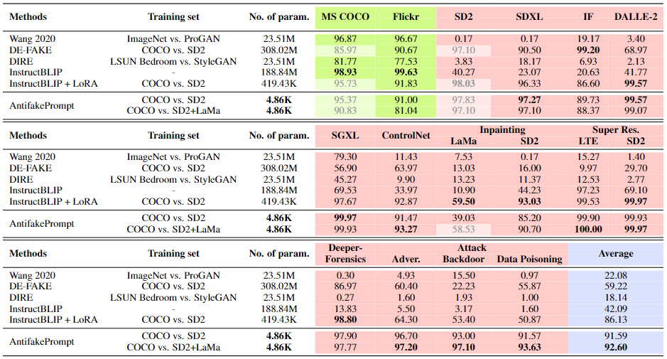

# AntifakePrompt: Prompt-Tuned Vision-Language Models are Fake Image Detectors

<div align="center">
    <a></a>
    <a></a>
</div>

This is the official implementation of AntifakePrompt [paper].

## Introduction

In this paper, being inspired by the zero-shot advantages of Vision-Language Models (VLMs), we propose **AntifakePrompt**, a novel approach using VLMs (e.g. InstructBLIP) and prompt tuning techniques to improve the deepfake detection accuracy over unseen data. We formulate deepfake detection as a visual question answering problem, and tune soft prompts for InstructBLIP to answer the real/fake information of a query image. We conduct full-spectrum experiments on datasets from 3 held-in and 13 held-out generative models, covering modern text-to-image generation, image editing and image attacks. Results demonstrate that (1) the deepfake detection accuracy can be significantly and consistently improved (from 58.8\% to 91.31\%, in average accuracy over unseen data) using pretrained vision-language models with prompt tuning; (2) our superior performance is at less cost of trainable parameters, resulting in an effective and efficient solution for deepfake detection.

<p align="center">

</p>

<p align="center">

</p>

## Prerequisites

### Environment installation

```
git clone https://github.com/thisismingggg/AntifakePrompt.git
cd AntifakePrompt
pip install -e .
```
### Vicuna weights preparation

AntifakePrompt uses frozen Vicuna 7B models. Please first follow the [instructions](https://github.com/lm-sys/FastChat) to prepare Vicuna v1.3 weights. Then modify the `llm_model` in the [Model Config](lavis/configs/models/blip2/blip2_instruct_vicuna7b_textinv.yaml) to the folder that contains Vicuna weights.

### Checkpoints downloading
We provide the best two checkpoints in our experiments:
- COCO+SD2 (150k training images)
- COCO+SD2+LaMa (180k training images)

```
cd ckpt
sh download_checkpoints.sh
```
The downloaded checkpoints will be saved in `ckpt`.

| Checkpoint name                                                                                                       | Training dataset  | Average Acc. (%) |
| --------------------------------------------------------------------------------------------------------------------- |:----------------- | ---------------- |
| [COCO_150k_SD2_SD2IP.pth](https://drive.google.com/file/d/1fu8oxPI0eXrqtlgYKg00SfgXC-jZVCaT/view?usp=share_link)      | COCO + SD2        | 91.59            |
| [COCO_150k_SD2_SD2IP_lama.pth](https://drive.google.com/file/d/1bltqH3KPT03ypb49c4bs0VXKsaY6lKb7/view?usp=share_link) | COCO + SD2 + LaMa | 92.60            |

### Dataset
We provide our training, validation and testing dataset in the paper, as the following table shows.


| Split | Real dataset | Fake dataset                                                                                                                                                                          |
| ----- | ------------ |:------------------------------------------------------------------------------------------------------------------------------------------------------------------------------------- |
| [Train](https://eva-lab.synology.me:8001/sharing/6EkZkWYI1) | COCO         | SD2                                                                                                                                                                                   |
| [Val](https://eva-lab.synology.me:8001/sharing/12NEnnsQ1)   | COCO         | SD2                                                                                                                                                                                   |
| [Test](https://eva-lab.synology.me:8001/sharing/LjzEDo7R0)  | COCO, Flickr | SD2, SDXL, IF, DALLE-2, SGXL, ControlNet, DeeperForensic, Inpainting(LaMa), Inpainting(SD2), SuperRes(LTE), SuperRes(SD2), Adversarial attack, Backdoor attack, Data poisoning attack |


## Testing

### Set the checkpoint path
Go to [Model Config](lavis/configs/models/blip2/blip2_instruct_vicuna7b_textinv.yaml) and set the key value of `model: finetune` to the checkpoint of prompt-tuned model (downloaded in [Checkpoints downloading](#Checkpoints-downloading)).

### Classify a single image

```
python test.py --img_path <path_to_image>
```
### Classify batch of images
1. Put the real images in a folder, and put the fake images in another folder.
2. Run the command
```
python test.py --real_dir <real_image_directory> --fake_dir <fake_image_directory>
```
If the data only contains real images or fake images, you can just assign one of the arguments between `--real_dir` and `--fake_dir`.

> The `--log` argument determine the log file path when classifying a batch of images. (default=`log/log.txt`)

## Training

1. Go to [Dataset Config](lavis/configs/datasets/textinv/textinv.yaml), set `real_dir` and `fake_dir` for train/valid/test split.
2. Go to [Training Config](lavis/projects/textual-inversion/textinv_train.yaml), set the parameters properly. 
3. Run the command to start training:

```
sh LAVIS/run_scripts/textual-inversion/train.sh
```
 
 ## Citation
 
 
 ## Acknowledgement

This project is built upon the the following gaint sholders. Great thanks to them!

- InstructBLIP: https://github.com/salesforce/LAVIS/tree/main/projects/instructblip
- Stable diffusion: https://github.com/Stability-AI/stablediffusion
- Textual Inversion: https://github.com/rinongal/textual_inversion