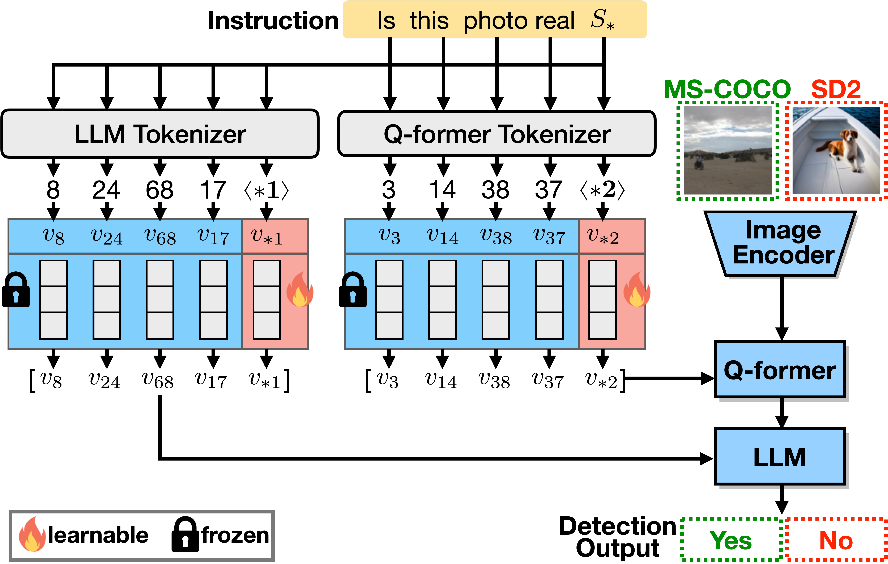

# AntifakePrompt: Prompt-Tuned Vision-Language Models are Fake Image Detectors

This is the official implementation of AntifakePrompt [paper]. AntifakePrompt propose a prompt-tuned vision-language model from [InstructBLIP](https://github.com/salesforce/LAVIS/tree/main/projects/instructblip) as a deepfake detector.



## Installation

```
git clone https://github.com/thisismingggg/LAVIS.git
cd LAVIS
pip install -e .
```

## Prepare Vicuna Weights
AntifakePrompt uses frozen Vicuna 7B models. Please first follow the [instructions](https://github.com/lm-sys/FastChat) to prepare Vicuna v1.3 weights. Then modify the `llm_model` in the [Model Config](lavis/configs/models/blip2/blip2_instruct_vicuna7b_textinv.yaml) to the folder that contains Vicuna weights.

## Prepare Dataset

Following the steps below, you will get a **.csv file** containing all the image paths and corresponding label for training and testing.

1. Go to [Path and Label Generator Bash](utils/gen_path_label.sh), modify the parameters below:

- `real_dir` / `fake_dir` : the directory to your real / fake images.
- `real_label` / `fake_label` : the ground truth label for real / fake images.
- `out` : the path to the output .csv file.

2. After setting all the arguments above, run the command:
```
sh LAVIS/utils/gen_path_label.sh
```
3. You will get an output .csv file recording each image path and corresponding ground truth label.

## Testing

1. Go to [Model Config](lavis/configs/models/blip2/blip2_instruct_vicuna7b_textinv.yaml) and set the key value of `model: finetune` to the checkpoint of prompt-tuned model.
2. Go to [Test Bash](deepfake-detection/test.sh), modify the parameters below:

- `question` : the question prompt fed into the model.
- `data_csv` : the csv file you just generated from [Preparing Dataset](##Preparing-Dataset).
- `log` : the log file path, which will record the testing result.

3. After setting all the arguments above, run the command below:
```
sh LAVIS/deepfake-detection/test.sh
```

## Training

1. Go to [Dataset Config](lavis/configs/datasets/textinv/textinv.yaml), set the `url` and `storage` key value to the path of generated .csv file for train/val/test dataset.
2. Go to [Training Config](lavis/projects/textual-inversion/textinv_train.yaml), set the parameters properly. (Please refer to [Training parameters](##Training-parameters) for detail description)
3. Run the command to start training:

```
sh LAVIS/run_scripts/textual-inversion/train.sh
```

## Checkpoint

- Checkpoints of prompt-tuned models can be downloaded [here](https://drive.google.com/drive/folders/1JgMJie4wDt7dNeHkT25VVuzG9CdnA9mQ?usp=drive_link).

## Training parameters

This part list the key parameters for training.
| **Parameter name**                                         | **Description**                                                                                                      |
|------------------------------------------------------------|----------------------------------------------------------------------------------------------------------------------|
| model: prompt                                              | The question prompt for training (including pseudo word).                                                            |
| model: pseudo_word                                         | The word which is the optimization target, so it should be in the question prompt.                                   |
| model: init_word                                           | The intializing word for the pseudo word embedding. (If not specified, the pseudo word will be randomly initailized) |
| datasets: textinv: vis_processor: mean/std                 | The mean/std for image normalization.                                                                                |
| datasets: textinv: text_processor: train/eval: prompt      | The question prompt for training/evaluation (should be the same as model:prompt).                                    |
| datasets: textinv: text_processor: train/eval: pseudo_word | The word which is the optimization target for training/evaluation (should be the same as model:pseudo_word).         |
| run: lr_sched                                              | The type of learning rate scheduler.                                                                                 |
| run: max_epoch                                             | The number of training epochs.                                                                                       |
| run: batch_size_train/eval                                 | The batch size for training/evaluation.                                                                              |

 Please refer to the original [InstructBLIP](https://github.com/salesforce/LAVIS/tree/main/projects/instructblip) repo for the other parameters that not listed above.
